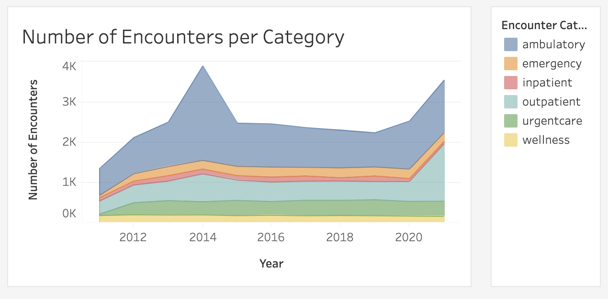

# Hospital_Analytics_Dashboard
SQL, Tableau

## Objective:
The goal of this project was to visualize and analyze a hospital’s patient encounter data using Tableau. The objective was to uncover yearly trends, encounter class distributions, procedure costs, and payer coverage patterns to support data-driven decision-making in hospital operations and healthcare cost management.

Tools Used:

- SQL: Data cleaning, filtering, and aggregation of large healthcare claims datasets.

- Tableau: Data visualization and dashboard creation for interactive analysis and reporting.

## Executive Summary

This project analyzed a hospital’s patient encounter data using SQL and Tableau to uncover trends in healthcare utilization, costs, and payer coverage. The analysis revealed that encounters peaked in 2014 and 2021, with Ambulatory and Outpatient visits making up the majority of patient activity. Inpatient and Urgent Care encounters consistently generated the highest total claim costs, while nearly half of all encounters lacked payer coverage, highlighting a substantial uninsured population. The most frequent procedures included assessments, hospice care, and depression screenings, while ICU admissions and major surgeries represented the highest costs. Medicaid provided the greatest average coverage, whereas uninsured patients faced the highest out-of-pocket expenses. These findings suggest opportunities to enhance operational efficiency through expanded outpatient care, improve financial stability by addressing uninsured populations, and strengthen resource planning to anticipate demand surges.

## Data Structure and Overview

This dataset represents a relational healthcare database designed to capture detailed information about hospital encounters, patients, organizations, payers, and medical procedures.

The encounters table is the central fact table, recording each patient visit with timestamps, encounter type (e.g., inpatient, outpatient, ambulatory), associated costs, and payer coverage details. It connects to supporting dimension tables through foreign keys:

- The patients table stores demographic and geographic information such as age, gender, race, marital status, and location, allowing demographic-based analysis of healthcare utilization.

- The organizations table identifies healthcare facilities where encounters occur, including their name, address, and geolocation data (latitude and longitude), enabling spatial and institutional analysis.

- The payers table contains information about insurance providers, including their names, addresses, and headquarters, supporting analyses of coverage and claim costs by insurer.

- The procedures table records specific medical procedures performed during encounters, including codes, descriptions, base costs, and medical reasons, allowing cost and frequency analyses of treatments and services.

Together, these linked tables form a star-schema-like structure, where encounters serve as the central hub connecting patient, payer, organization, and procedure data. This schema supports comprehensive healthcare analytics — such as identifying cost drivers, evaluating payer performance, understanding patient demographics, and analyzing procedure patterns across time and locations.

## Insights
[Hospital Analytics Dashboard](https://public.tableau.com/app/profile/sierra.brock/viz/Hospital_Analytics_Dashboard/Dashboard1?publish=yes)

### Procedure Insights

Most Frequent Procedures:

- Assessment of health and social care needs

- Hospice care

- Depression screening

- Renal dialysis

- Medication reconciliation

Most Expensive Procedures:

- Admit to ICU — $206,260.40 (Avg.)

- Coronary artery bypass grafting — $47,085.89 (Avg.)

- Lumpectomy of breast — $29,353.00 (Avg.)

### Payer Coverage & Out-of-Pocket Costs

- NO_INSURANCE patients had the highest out-of-pocket costs, followed by Anthem and Humana.

- Medicaid provided the highest total claim coverage ($6,205.22 avg.), followed by Blue Cross Blue Shield and Medicare.

### Encounters Overview

- Encounters increased steadily from 2011 to 2014, with a major spike in 2014 and another in 2021.

- The Ambulatory category consistently represented the largest share of encounters, peaking at 60.3% in 2014.

- Only 4.1% of encounters lasted more than 24 hours, suggesting most visits were short-term.

- Outpatient encounters notably rose in 2021 (40.2%), narrowing the gap with Ambulatory visits.

### Cost & Coverage Insights

- Total claim costs peaked in 2011 and again in 2020, reflecting potential operational or demand surges.

- Inpatient and Urgent Care encounters consistently had the highest total claim costs.

- Nearly 48.7% of all encounters had no payer coverage, representing a significant uninsured population.

## Summary of Insights

- Encounters surged in 2014 and 2021, likely linked to external healthcare or policy changes.

- Ambulatory and Outpatient visits dominate patient activity, while Inpatient and Urgent Care drive the highest costs.

- Nearly half of encounters lack payer coverage, representing a major financial challenge for the hospital.

## Recommendations: 

- Operational Efficiency: Reduce inpatient costs by expanding outpatient services and preventive care programs.

- Financial Strategy: Address uninsured patient segments through financial assistance programs or partnerships.

- Policy Planning: Monitor yearly encounter spikes (e.g., 2014 and 2021) to optimize resource allocation and staffing.
